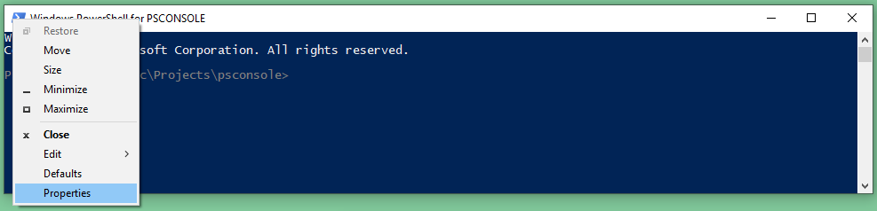

# PSConsole

**some scripts to work with different Windows PowerShell profiles and to initialize a Windows PowerShell console**

If you are like me, working on a couple of projects (or project versions) at the same time, it is a real hassle to go and change the PowerShell profile settings in `~\Documents\WindowsPowerShell`.  So I needed a better system to do this.

My requirements are:
- When starting PowerShell from anywhere within a project, pick-up the project's profile
- When starting Powershell from outside a project, pick-up a default profile
  - if I defined a default project, the profile for that project
  - if I didn't, a generic profile


Also, it is not really easy to find out how to change the colors for the PowerShell console.  There are an enormous amount of web-pages on this subject, lots of different methods to try.  Different methods for different versions of PowerShell.  I needed to find the best way for me.

My requirements are:
- Changing the colors of the PowerShell console
- Changing the window title for different projects (or project versions)
- Changing the window title and the prompt when running as 'Administrator'
- Changing the window title and the background color when working with different servers, VMs, clusters,...


## Project Profiles

An overview of the profile structure

```text
HOME
  |-- .psconsole.json
  |
  |-- Documents
  |     |-- WindowsPowerShell
  |           |-- console.json
  |           |-- profile.ps1             # <<<<<<<<<< master profile
  |           |                           #            (incl. default-master profile)
  |           |-- scripts
  |                 |-- Apply-PSConsoleSettings.ps1
  |
  |-- Projects
        |-- .psprofile.ps1                # <<<<<<<<<< default-project profile
        |
        |-- project-1
        |     |-- .psconsole.json
        |     |-- .psprofile.ps1          # <<<<<<<<<< project profile
        |     |
        |     |-- scripts
        |           |-- Apply-PSConsoleSettings.ps1
        |
        |-- project-2
        |     |-- .psconsole.json
        |     |-- .psprofile.ps1          # <<<<<<<<<< project profile
        |     |
        |     |-- scripts
        |           |-- Apply-PSConsoleSettings.ps1
        .
        .
        .
        |-- project-N
              |-- .psconsole.json
              |-- .psprofile.ps1          # <<<<<<<<<< project profile
              |
              |-- scripts
                    |-- Apply-PSConsoleSettings.ps1
```

### The master profile

You can find the master profile in the folder `~\Documents\WindowsPowerShell` in a file called `profile.ps1`.  

> :information_source:  
> There are actually a number of profiles on your machine.  We are using the `CurrentUserAllHosts` profile here.  For more info, see https://docs.microsoft.com/en-gb/powershell/module/microsoft.powershell.core/about/about_profiles, but documentation doesn't always seem to line-up with what we see in a PowerShell console.

If the folder or file are not there, you should create it.  You can pick-up our profile from the `scripts` folder in this project (`@HOME-Documents-WindowsPowerShell_profile.ps1`) and rename it `profile.ps1`.  Remark that you may have to change the marked line at the end, pointing to the default-project profile.

> :warning:  
> you may also need to copy the corresponding `console.json` used by the `Apply-PSConsoleSettings` script in our profile.  More info [here](#the-default-master profile).

We want to run a different profile depending on the current directory.

- when you open Powershell from the start menu, it will open in a default directory (usually `C:\Windows\System32`)
- when you start PowerShell from a command prompt, it will open in the current directory of the Command Prompt
- when you type `powershell` in the address bar of Windows Explorer, it will open in the current Windows Explorer directory
- when you start PowerShell from a `PowerShell Here` context menu, the current directory will depend on the place where you opened the menu.


Assuming you don't use the `-NoProfile` option, PowerShell will always start executing the master profile.

- The master profile we are using, will look in the current directory, to see if there is a `.psprofile.ps1` file it can run.
- If there is none, it will look in the first parent, grand-parent, ..., up to the user's home directory, for a `.psprofile.ps1` file it can run.
- When it finds one, it will set the `$ROOT` variable to this path and run the profile found.
- When it doesn't find one, it will run the default-project profile and sets the `$ROOT` variable.
- If that also fails, we run the default-master profile and set the `$ROOT` variable to the home directory.


### The project profile

Most of my projects use a profile that's very similar to the `@HOME-Projects-myproject_.profile.ps1` in the `scripts` folder of this project.

- We set `$ROOT` to the project directory
  - if you pick-up our script, you will need to adapt the path for `$ROOT`.
- We add the `$ROOT\scripts` folder to `$env:PATH`
- If we are not already somewhere under the project root-directory, we set the current directory to the project root-directory
- We apply settings to the PowerShell console (see further)
  - for this, you need to copy the `Apply-PSConsoleSettings.ps1` script in the `scripts` folder of this project, and put it under the `$ROOT\scripts` folder in your project.
  - you also need to copy the `@HOME-Projects-myproject_.profile.ps1` in the `scripts` folder of this project to you root folder, and rename it `.psconsole.json`


Our project-profile looks something like

```powershell
Set-Variable HOME "$env:USERPROFILE" -Scope Global -Force
( Get-PSProvider 'FileSystem' ).Home = $HOME   # replace "~"

$global:ROOT = "$HOME\Projects\psconsole"
$env:PATH = "$ROOT\scripts;$env:PATH"

if ( -not ( Get-Location ).Path.StartsWith("$ROOT") ) {
    Set-Location "$ROOT"
}

Apply-PSConsoleSettings "PSCONSOLE"
```

> :warning:  
> The `$HOME` variable doesn't always seem to correctly populated, hence we set it in this profile. We experienced a lot of issues with this on different computers and with different versions of PowerShell (probably because of a lack of understanding?).  You can find more info about the `$HOME` variable here: https://docs.microsoft.com/en-gb/powershell/module/microsoft.powershell.core/about/about_automatic_variables, but the documentation doesn't always seem to line-up with what we see in a PowerShell console.
> 
> - By default we use `"$env:USERPROFILE"`.  Although this is in my experience the most reliable way, this variable may not be correctly set on your machine.  
> - An alternative (this is what the PowerShell documentation states as the method it uses "automatically") is to use `"$env:HOMEDRIVE$env:HOMEPATH"`.
> - You can look for other variables in your environment (or add them) to help you create the correct `$HOME` variable.  
> - You can look for solutions on the web.  
> - Perhaps you need to update some registry items?  
> - Ultimately, as a last resort, you can hard-code your home-path as a string.

> :bulb:  
> We copy the `Apply-PSConsoleSettings` to every project.  This avoids issues when the script gets updated for a new project while scripts and corresponding profiles of old projects are not updated.

### The default-project profile

I like to put all my projects in a `~/Projects` folder so that is where I put my `.psprofile.ps1` file, but you can put it anywhere else and give it any name you want.  You can pick-up our profile from the `scripts` folder in this project (`@Projects_.psprofile.ps1`), rename it and adapt it.

- If you are using our master profile, update the marked line at the end of the master profile.


The job of the default-project profile is to select a default project and run its profile.  In our sample default-project profile, we list all our projects in comments in the script, and uncomment the project we consider our "default" at the moment (only uncomment projects that have a project-profile).  This makes it very easy to switch "default" projects.

```powershell
. ~/Projects/psconsole/.psprofile.ps1
#. ~/Projects/kluster/.psprofile.ps1
#. ~/Projects/steps/.psprofile.ps1
#. ~/Projects/globals/.psprofile.ps1   #<<< !!! has no project-profile at the moment
```


### The default-master profile

The last section in the master-profile is the default-master profile.  You can put whatever you want in there.  We use something similar to the project profiles in our default-master profile

- We set `$ROOT` to the home directory
- We add the `~\Documents\WindowsPowerShell\scripts` folder to  `$env:PATH`
- If we are not already somewhere under the home directory, we set the current directory to the home directory
- We apply settings to the PowerShell console (see further)
  - for this, you need to copy the `Apply-PSConsoleSettings.ps1` script in the `scripts` folder of this project, and put it under the `~\Documents\WindowsPowerShell\scripts` folder on your machine.
  - you also need to copy the `@HOME-Documents-WindowsPowerShell_console.json` file in the `scripts` folder of this project to your `~\Documents\WindowsPowerShell` folder, and rename it `console.json`


Our default master profile looks something like

```powershell
$global:ROOT = $HOME
$env:PATH = "$ROOT\Documents\WindowsPowerShell\scripts;$env:PATH"

if ( -not ( Get-Location ).Path.StartsWith("$ROOT") ) {
    Set-Location "$ROOT"
}

Apply-PSConsoleSettings
```


<br/>

## Console Properties

There are lots of properties that can be changed, but we will focus on colors:
- The color palette used by the console (as defined in the properties of a shortcut to PowerShell)
- The foreground and background colors of the console
- The colors of the output to various streams
- The colors used for syntax-highlighting
- The colors of the prompt

A couple of other properties we want to adapt
- The title of the PowerShell console window, including an indication when we are running in elevated mode
- An indication in the prompt when we are running in elevated mode

To control all of this, we use a script `Apply-PSConsoleSettings.ps1` in combination with a JSON configuration file.  You can find the default configuration for a project in `$ROOT\.psconsole.json`.


### The window title and prompt

> :warning:  
> In this and following sections, we will use the `Apply-PSConsoleSettings` script to set window titles and change colors.
For this to work, you **MUST** copy the `@HOME_.psconsole.json` file to your home directory and rename it to `.psconsole.json`, **AND** do the same for any project folders where you want to use this script in your project-profile.

To add the project name to the window title - for instance "PSCONSOLE"

```powershell
Apply-PSConsoleSettings "PSCONSOLE"
```

This gives


- remark that the color of the prompt is also dimmed - this will be discussed below.

When running PowerShell as an administrator, an indication of this is added to title and prompt


If you don't like what we did with the prompt, you can disable the changes to the prompt

```powershell
Apply-PSConsoleSettings "PSCONSOLE" -NoPrompt
```

### The color palette

To understand the sometimes "unexpected" results when changing colors, we need a bit more explanation to understand some of the basics of color palettes.

The color palette consists of 16 colors.  Default color-values are defined in a color-table in the registry (`ColorTable00` .. `ColorTable15`).  This can be overridden in the properties of a shortcut to PowerShell  application (`.lnk` file), hence colors can be different depending on how you start the console.



> :warning:  
> If you change colors of the `Defaults`, you will be changing color-table for the PowerShell application in the registry, so the new colors will apply to all instances of Powershell.  If you change the colors in the `Properties`, the changes are only applied to instances of PowerShell that are started via the specific shortcut where you changed the properties (overriding the `Defaults`).  
> More info on the hierarchy of loaded settings can be found here: https://devblogs.microsoft.com/commandline/understanding-windows-console-host-settings/


- The color palette shown here is the color palette associated to the `Properties` of the shortcut in the start menu.
- The colors of the color-table in the registry correspond to the colors in the `Defaults` and `Properties` from left to right.

> :bulb:  
> The PowerShell shortcut can usually be found in the Start Menu: `"$env:APPDATA\Microsoft\Windows\Start Menu\Programs\Windows PowerShell\Windows PowerShell.lnk"` (or with the `(x86)` suffix for the 32-bit version).

To illustrate the difference between the color palettes when starting Powershell in different ways, below, we started the console from the Run app


- One of the immediate differences you can observe is the much less saturated yellow color of the `[Administrator]` indication in the prompt, compared to the higher screenshot.

And the corresponding color properties


- When we started PowerShell from the Run app, we started the `.exe` application, not the `.lnk` shortcut on the Start Menu.  This is using the default color-table for `powershell.exe` from the registry instead of the properties of a shortcut.  

> :information_source:  
> The colors or your PowerShell.exe console may be different than what's shown here.  This is because the default console colors were recently changed to a dimmer version ( https://devblogs.microsoft.com/commandline/updating-the-windows-console-colors/ ), so your installation may still be using the legacy colors in the registry color-tables.

An overview

ColorTable | Foreground ANSI/VT100 | Background ANSI/VT100 | PowerShell Name | Legacy Console | New  Console | PowerShell Color
---------------|----------|-----------|---------------|---------------|---------------|--------------
`ColorTable00` | ``e[30m` | ``e[40m`  | `Black`       | (0,0,0)       | (12,12,12)    | -
`ColorTable01` | ``e[34m` | ``e[44m`  | `DarkBlue`    | (0,0,128)     | (0,55,128)    | -
`ColorTable02` | ``e[32m` | ``e[42m`  | `DarkGreen`   | (0,128,0)     | (19,161,14)   | -
`ColorTable03` | ``e[36m` | ``e[46m`  | `DarkCyan`    | (0,128,128)   | (58,150,221)  | -
`ColorTable04` | ``e[31m` | ``e[41m`  | `DarkRed`     | (128,0,0)     | (197,15,31)   | -
`ColorTable05` | ``e[35m` | ``e[45m`  | `DarkMagenta` | (128,0,128)   | (136,23,152)  | (1,36,86)
`ColorTable06` | ``e[33m` | ``e[43m`  | `DarkYellow`  | (128,128,00)  | (193,156,0)   | (238,237,240)
`ColorTable07` | ``e[37m` | ``e[47m`  | `Gray` (`DarkWhite`)      | (192,192,192) | (204,204,204) | -
`ColorTable08` | ``e[90m` | ``e[100m` | `DarkGray` (`LightBlack`) | (128,128,128) | (118.118,118) | -
`ColorTable09` | ``e[94m` | ``e[104m` | `Blue`        | (0,0,255)     | (59,120,255)  | -
`ColorTable10` | ``e[92m` | ``e[102m` | `Green`       | (0,255,0)     | (22,198,12)   | -
`ColorTable11` | ``e[96m` | ``e[106m` | `Cyan`        | (0,255,255)   | (97,214,214)  | -
`ColorTable12` | ``e[91m` | ``e[101m` | `Red`         | (255,0,0)     | (231,72,86)   | -
`ColorTable13` | ``e[95m` | ``e[105m` | `Magenta`     | (255,0,255)   | (180,0,158)   | -
`ColorTable14` | ``e[93m` | ``e[103m` | `Yellow`      | (255,255,0)   | (249,241,165) | -
`ColorTable15` | ``e[97m` | ``e[107m` | `White`       | (255,255,255) | (242,242,242) | -

- The ColorTable names are the names as you will find them in the registry.
- The ANSI/VT100 codes are the codes you can use to change colors in strings.  Remark that this is only works on newer versions of PowerShell.  The ``e` escape code will also only work on newer versions of Powershell, but can be replace by `$e = [char]27` or `$e = [char]0x1B`.
- In Powershell scripts, you don't use the names `ColorTable00`, etc... to specify colors.  Instead you use: `Black`, `DarkBlue`, ..., `White`.
- The `Screen Text` and `Screen Background` have been changed from the default console colors, specifically for the PowerShell console.  
- As written before, the default console colors have recently been redefined ( https://devblogs.microsoft.com/commandline/updating-the-windows-console-colors/ ).
- Colors you see may be completely different than what is expected from the name.  For instance the links to PowerShell in the Start Menu redefine `DarkMegenta` and `DarkYellow`.  Also the PowerShell `.lnk` shortcut in the Start Menu is using the legacy console colors, while the PowerShell `.exe` application is using the new console colors.


### The colors of the console

> :warning:  
> From Windows 10 build 1809 onward, the `PSReadline` module was upgraded from version 1.2 to a 2.0.0-beta version.  This beta version causes a lot of issues that cannot be worked around.  To make the following work, you **MUST** downgrade the `PSReadLine` module to version 1.2
> 
> - check if you have version 2.0.0
>
>   ```powershell
>   Get-Module PSReadLine
>   ```
>
>   gives
>
>   ```text
>   ModuleType Version    Name           ExportedCommands
>   ---------- -------    ----           ----------------
>   Script     2.0.0      PSReadLine     {Get-PSReadlineKeyHandler, Get-PSReadlineOption, Remove-PS...
>   ```
>
> - run PowerShell as administrator, and execute
>
>   ```powershell
>   Install-Module -Name PSReadLine -RequireVersion 1.2 -SkipPublisherCheck
>   ```
>  
> - delete `C:\Program Files\WindowsPowerShell\Modules\PSReadline\2.0.0`
> - check
>
>   ```powershell
>   Get-InstalledModule PSReadLine
>   ```
>
>   gives
> 
>   ```text
>   Version           Name           Repository           Description
>   -------           ----           ----------           -----------
>   1.2               PSReadLine     PSGallery            Great command line editing in the Powe...
>   ```

As explained in the [previous section](#the-color-palette), the colors of the console are defined in the registry and in the properties of a shortcut to the PowerShell application.  We don't really want to change the registry because that changes colors for every instance of the application, so we are going to focus on creating shortcuts, and change the colors of these shortcuts.

- `New-Shortcut` creates a new shortcut.

  ```powershell
  New-Shortcut "$ROOT/scripts/my-powershell.lnk" -TargetPath "$env:SystemRoot\system32\WindowsPowerShell\v1.0\powershell.exe"
  ```
  - remark the name of the shortcut should be the **full** path to the shortcut, an the extension `.lnk` is optional.
  - have a look at the top of the script in the `scripts` folder for more parameters, f.i. `-Arguments` and `-WorkingDirectory`

- `Get-Shortcut` is used by the other scripts.  It gets an object to modify the properties of a shortcut.

  > :information_source:  
  > This is the age-old `Get-Link` you find in a lot of posts on this subject.  The link provided in most of these posts doesn't work anymore.  Luckily, Neil Pankey (and friends) did find and preserve this code ( https://github.com/neilpa/cmd-colors-solarized/blob/master/Get-Link.ps1 ) - Thanks Neil :relieved:

- `Set-SortcutColors`

  ```powershell
  Set-ShortcutColors "$ROOT/playground/my-powershell.lnk" -Theme "$ROOT/colors/psconsole-powershell-legacy.json"
  ```

  themes are a json file, f.i. the `psconsole-powershell-legacy.json` theme

  ```javascript
  {
      "console": {
          "ScreenTextColor": 6,
          "ScreenBackgroundColor": 5,
          "PopupTextColor": 3,
          "PopupBackgroundColor": 15,
          "ConsoleColors": [
              "#000000",
              "#000080",
              "#008000",
              "#008080",
              "#800000",
              "#012456",
              "#eeedf0",
              "#c0c0c0",
              "#808080",
              "#0000ff",
              "#00ff00",
              "#00ffff",
              "#ff0000",
              "#ff00ff",
              "#ffff00",
              "#ffffff"
          ]
      }
  }
  ```

  - We developed a number of color-schemes based on the very popular `Solarized` theme, but with a couple of modifications, and added more choices in background colors.  You can read more on the `Colorized` themes [here](/docs/color-schemes.md)
  - We also added a couple based on the traditional Powershell background color.

  > :warning:  
  > Remark that you need to run `Apply-PSConsoleSettings` in your profile with a `.psconsole.json` file, to make sure that the above palettte colors are correctly mapped on the colors for Powershell elements (stream output, syntax tokens and prompt).

- `Set-ShortcutWindowSize` sets the size of the windows and screen-buffer

  ```powershell
  Set-ShortcutWindowSize "$ROOT/scripts/my-powershell.lnk" -Width 120 -Height 50 -ScreenBufferHeight 5000
  ```

- `Write-ColorizedColors` shows the colors of the color-scheme of the current shell.

- `Test-ColorizedColors` creates a folder `$ROOT/playground`, and in that folder a powershell-shortcut for every color-scheme.  You can see the result [here](/docs/color-schemes.md).


### The colors of the output to streams

> :warning:  
> In the this and following sections, we will use the `Apply-PSConsoleSettings` script to set window titles and change colors.
For this to work, you **MUST** copy the `@HOME_.psconsole.json` file to your home directory and rename it to `.psconsole.json`, **AND** do the same for any project folders where you want to use this script in your project-profile.

The `Apply-PSConsoleSettings` is used to map palette colors on the colors of the output to the different PowerShell streams.  The mapping is defined in the `.psconsole.json` file in the `$ROOT` folder.  This file **MUST** have three sections:

```javascript
{
    "UserColorScheme": {
        // ... mapping of 'Colorized' color-schemes on PowerShell elements in a normal user console
    },
    "AdminColorScheme": {
        // ... mapping of 'Colorized' color-schemes on PowerShell elements in an administrator console
    },
    "LegacyColorScheme": {
        // ... mapping of 'powershell-legacy' and '-campbell' color-schemes on PowerShell elements in any console
    }
}
```

The mapping of foreground and background colors for streams is defined by properties `"Stream*"`, for instance for the `"LegacyColorScheme"`

```javascript
        "StreamOutputForegroundColor": "DarkYellow",
        "StreamOutputBackgroundColor": "DarkMagenta",

        "StreamErrorForegroundColor": "Red",
        "StreamErrorBackgroundColor": "Black",

        "StreamWarningForegroundColor": "Yellow",
        "StreamWarningBackgroundColor": "Black",

        "StreamDebugForegroundColor": "Yellow",
        "StreamDebugBackgroundColor": "Black",

        "StreamVerboseForegroundColor": "Yellow",
        "StreamVerboseBackgroundColor": "Black",

        "StreamProgressForegroundColor": "Yellow",
        "StreamProgressBackgroundColor": "DarkCyan",
```


### The colors of the syntax-highlighting

The mapping of foreground and background colors for syntax-highlighting is defined by properties `"Syntax*"`, for instance for the `"LegacyColorScheme"`

```javascript
        "SyntaxCommandForegroundColor": "Yellow",
        "SyntaxCommandBackgroundColor": "DarkMagenta",

        "SyntaxCommentForegroundColor": "DarkGreen",
        "SyntaxCommentBackgroundColor": "DarkMagenta",

        "SyntaxContinuationPromptForegroundColor": "DarkYellow",
        "SyntaxContinuationPromptBackgroundColor": "DarkMagenta",

        "SyntaxDefaultForegroundColor": "DarkYellow",
        "SyntaxDefaultBackgroundColor": "DarkMagenta",

        "SyntaxEmphasisForegroundColor": "Cyan",
        "SyntaxEmphasisBackgroundColor": "DarkMagenta",

        "SyntaxErrorForegroundColor": "Red",
        "SyntaxErrorBackgroundColor": "DarkMagenta",

        "SyntaxKeywordForegroundColor": "Green",
        "SyntaxKeywordBackgroundColor": "DarkMagenta",

        "SyntaxMemberForegroundColor": "White",
        "SyntaxMemberBackgroundColor": "DarkMagenta",

        "SyntaxNumberForegroundColor": "White",
        "SyntaxNumberBackgroundColor": "DarkMagenta",

        "SyntaxOperatorForegroundColor": "DarkGray",
        "SyntaxOperatorBackgroundColor": "DarkMagenta",

        "SyntaxParameterForegroundColor": "DarkGray",
        "SyntaxParameterBackgroundColor": "DarkMagenta",

        "SyntaxSelectionForegroundColor": "DarkMagenta",
        "SyntaxSelectionBackgroundColor": "DarkYellow",

        "SyntaxStringForegroundColor": "DarkCyan",
        "SyntaxStringBackgroundColor": "DarkMagenta",

        "SyntaxTypeForegroundColor": "Gray",
        "SyntaxTypeBackgroundColor": "DarkMagenta",

        "SyntaxVariableForegroundColor": "Green",
        "SyntaxVariableBackgroundColor": "DarkMagenta",
```


### The colors of the prompt

The mapping of foreground and background colors for the prompt is defined by properties `"Prompt*"`, for instance for the `"LegacyColorScheme"`

```javascript
        "PromptForegroundColor": "DarkYellow",
        "PromptBackgroundColor": "DarkMagenta"
```


<br/>

## For Further Investigation

- Monitor evolution of the `PSReadLine` version 2.0.0 module
- Add script to set the console font and font-size
