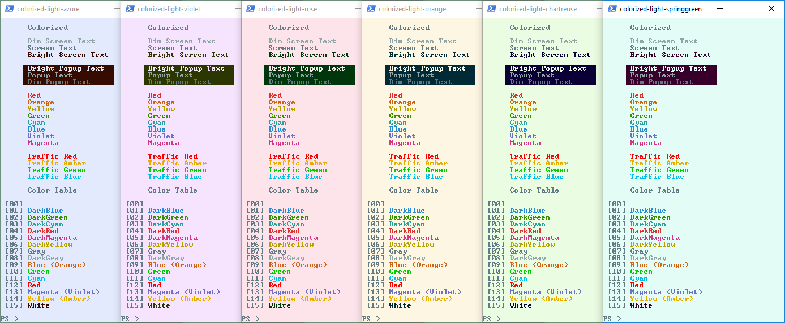
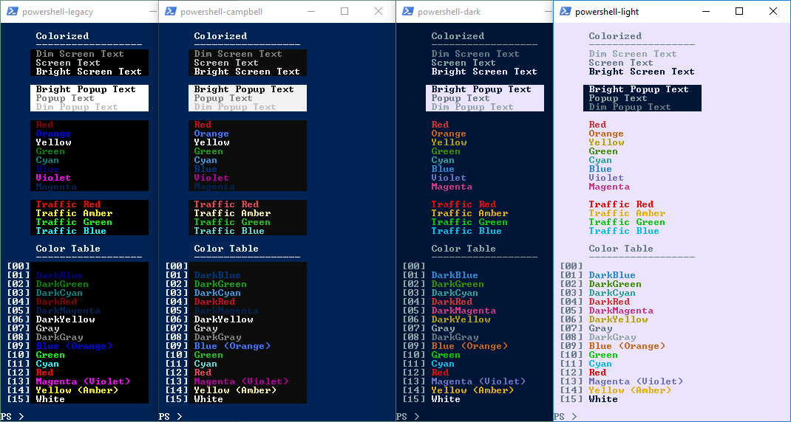

# Color-Schemes

We based our main color-scheme  on the very successful "Solarized" theme (https://ethanschoonover.com/solarized/), but changed it a bit.

- we added more background colors so we can color code terminal backgrounds for different servers, clusters, etc ... , all using the same foreground colors.

- we reduced the number of base colors to make room for the saturized `TrafficRed`, `TrafficAmber`, `TrafficGreen` and `TrafficBlue` colors.  We really want to have some colors that pop when indicating an "Error", "Warning", "Success" or "Debug".

- we mappped the Solarized colors on the PowerShell color-names in a bit a different way than other Solarized projects.  We are not really planning to put this in the registry, so it is not important to map the colors on the current defaults of the console applications like Command Prompt, PowerShell, etc...  Instead, we tried to map them in a way we can remember when writing code - although there are a couple of cases where that is not really successful

  - we mapped screen-background color on `Black`, the screen-text color on `Gray` (a.k.a. `DarkWhite`), the popup-background color on `White` and the popup-text color on `DarkGray` (a.k.a. `LightBlack`)
  - we mapped most of the accent colors on the corresponding `Dark` colors, and the traffic colors on the corresponding `Light` colors (`TrafficAmber` -> `Yellow`, `TrafficBlue` -> `Cyan`).
  - The exceptions to these "memorable" mappings are the colors from the RYB color-wheel.
  
    - `Orange` is mapped on the `Blue` Powershell name.  Remark that `Orange` is the RYB-complement of `Blue`.
    - `Violet` is mapped on the `Magenta` Powershell name.  This is kind of the wrong way around: `Magenta` is mapped on `DarkMagenta`, `Violet` - a kind of dark magenta - is mapped on `Magenta`.

- we slightly modified some of the Solarized colors

  - improved color-separation for light backgrounds, between `Red` & `Orange` and between `Yellow` and `Green`
  - improved distance between `DarkGrey` (`base00`) and `Gray` (`base0`)

- we added a number of alternative background colors - both in the dark and the light variant.  We rotated the `Hue` 30 degrees for each, and used same `Saturation` and lightness `Value`.

- we also added a couple of variations based on the powershell colors

- Note that the `powershell-legacy` and `-campbell` color-schemes are not really part of the `Colorized` family, hence the unexpected blue color with the "Orange" text in the images.  This is because the orange color is mapped on the `Blue` script-name (see color-table), as explained higher.  
- Remark also the yellow and the almost invisible magenta colors, which are the traditional PowerShell foreground and background colors, mapped on `DarkYellow` and `DarkMagenta` script-names (see color-table).

 

### Background Colors

Name               | Solarized Dark | RGB                        | HSV
:------------------|:---------|:---------------------------------|:---
`ScreenBackground` | `base03` | `#002b36` &emsp; (0, 43, 54)     | (192, 100%, 21%)
`PopupBackground`  | `base3`  | `#fdf6e3` &emsp; (253, 246, 227) | (44, 10%, 99%)

Name               | Solarized Light | RGB                       | HSV
:------------------|:---------|:---------------------------------|:---
`ScreenBackground` | `base3`  | `#fdf6e3` &emsp; (253, 246, 227) | (44, 10%, 99%)
`PopupBackground`  | `base03` | `#002b36` &emsp; (0, 43, 54)     | (193, 100%, 21%)

 

### Text Colors

Name                           | Solarized Dark | RGB                        | HSV
:------------------------------|:---------|:---------------------------------|:---
`DimScreenText` (=`PopupText`) | `base00` | `#657b83` &emsp; (101, 123, 131) | (195, 23%, 51%)
`ScreenText` (=`DimPopupText`) | `base0`  | `#91a4a6` &emsp; (145, 164, 166) | (186, 13%, 65%)
`BrightScreenText`             | `base3`  | `#fdf6e3` &emsp; (253, 246, 227) | (44, 10%, 99%)
`BrightPopupText`              | `base03` | `#002b36` &emsp; (0, 43, 54)     | (192, 100%, 21%)
`PopupText` (=`DimScreenText`) | `base00` | `#657b83` &emsp; (101, 123, 131) | (195, 23%, 51%)
`DimPopupText` (=`ScreenText`) | `base0`  | `#91a4a6` &emsp; (145, 164, 166) | (186, 13%, 65%)

- distance between `DimScreenText` (`base00`) and `ScreenText` (`base0`) slightly improved vs Solarized

Name                           | Solarized Light | RGB                       | HSV
:------------------------------|:---------|:---------------------------------|:---
`DimScreenText` (=`PopupText`) | `base0`  | `#91a4a6` &emsp; (145, 164, 166) | (186, 13%, 65%)
`ScreenText` (=`DimPopupText`) | `base00` | `#657b83` &emsp; (101, 123, 131) | (195, 23%, 51%)
`BrightScreenText`             | `base03` | `#002b36` &emsp; (0, 43, 54)     | (192, 100%, 21%)
`BrightPopupText`              | `base3`  | `#fdf6e3` &emsp; (253, 246, 227) | (44, 10%, 99%)
`PopupText` (=`DimScreenText`) | `base0`  | `#91a4a6` &emsp; (145, 164, 166) | (186, 13%, 65%)
`DimPopupText` (=`ScreenText`) | `base00` | `#657b83` &emsp; (101, 123, 131) | (195, 23%, 51%)

- distance between `DimScreenText` (`base00`) and `ScreenText` (`base0`) slightly improved vs Solarized

 

### Alternative Background Colors

Dark Backgrounds         | Popup               | RGB                          | HSV
:------------------------|:------------------- |:-----------------------------|:---
`Colorized Dark-Red`     | `Light-Azure`       | `#360b00` &emsp; (54, 11, 0) | (12, 100%, 21%)
`Colorized Dark-Yellow`  | `Light-Violet`      | `#2b3600` &emsp; (43, 54, 0) | (72, 100%, 21%)
`Colorized Dark-Green`   | `Light-Rose`        | `#00360b` &emsp; (0, 54, 11) | (132, 100%, 21%)
`Colorized Dark-Cyan`    | `Light-Orange`      | `#002b36` &emsp; (0, 43, 54) | (192, 100%, 21%)
`Colorized Dark-Blue`    | `Light-Chartreuse`  | `#0b0036` &emsp; (11, 0, 54) | (252, 100%, 21%)
`Colorized Dark-Magenta` | `Light-SpringGreen` | `#36002b` &emsp; (54, 0, 43) | (312, 100%, 21%)

- `Colorized Dark-Cyan` is based on Solarized Dark

Light Backgrounds             | Popup          | RGB                              | HSV
:-----------------------------|:---------------|:---------------------------------|:---
`Colorized Light-Orange`      | `Dark-Cyan`    | `#fdf6e3` &emsp; (253, 246, 227) | (44, 10%, 99%)
`Colorized Light-Chartreuse`  | `Dark-Blue`    | `#eafde3` &emsp; (234, 253, 227) | (104, 10%, 99%)
`Colorized Light-SpringGreen` | `Dark-Magenta` | `#e3fdf6` &emsp; (227, 253, 246) | (164, 10%, 99%)
`Colorized Light-Azure`       | `Dark-Red`     | `#e3eafd` &emsp; (227, 234, 253) | (224, 10%, 99%)
`Colorized Light-Violet`      | `Dark-Yellow`  | `#f6e3fd` &emsp; (246, 227, 253) | (284, 10%, 99%)
`Colorized Light-Rose`        | `Dark-Green`   | `#fde3ea` &emsp; (253, 227, 234) | (344, 10%, 99%)

- `Colorized Light-Orange` is based on Solarized Light

More Backgrounds    | Popup               | RGB                              | HSV
:-------------------|:--------------------|:---------------------------------|:---
`Powershell-Dark`   | `Powershell-Light`  | `#001636` &emsp; (0, 22, 54)     | (215, 100%, 21%)
`Powershell-Light`  | `Powershell-Dark`   | `#ece3fc` &emsp; (236, 227, 252) | (260, 10%, 99%)

 

### Accent Colors

Name             | RGB                              | HSV
:----------------|:---------------------------------|:---
`Red`            | `#dc322f` &emsp; (220, 50, 47)   | (1, 79%, 86%)
`Orange`         | `#cb6416` &emsp; (203, 100, 22)  | (26, 89%, 80%)
`Yellow`         | `#b5a000` &emsp; (181, 160, 0)   | (53, 100%, 71%)
`Green`          | `#389000` &emsp; (56, 153, 0)    | (98, 100%, 60%)
`Cyan`           | `#2aa198` &emsp; (42, 161, 152)  | (175, 74%, 63%)
`Blue`           | `#268bd2` &emsp; (38, 139, 210)  | (205, 82%, 82%)
`Violet`         | `#6c71c4` &emsp; (108, 113, 196) | (237, 45%, 77%)
`Magenta`        | `#d33682` &emsp; (211, 54, 130)  | (331, 74%, 83%)

- color-separation for light backgrounds slightly improved vs Solarized, between `Red` & `Orange` and between `Yellow` and `Green`

 

### Traffic Colors

Name             | RGB                            | HSV
:----------------|:-------------------------------|:---
`TrafficRed`     | `#ff0000` &emsp; (255, 0, 0)   | (0, 100%, 100%)
`TrafficAmber`   | `#e6ad00` &emsp; (230, 173, 0) | (45, 100%, 90%)
`TrafficGreen`   | `#00cc00` &emsp; (0, 204, 0)   | (120, 100%, 80%)
`TrafficBlue`    | `#00bfe6` &emsp; (0, 191, 230) | (190, 100%, 90%)

 

### More Colors

The following are definitions for the colors of the RGB and RYB color-wheels.  These can be used but they are not mapped on the 16 base colors, so one needs to use the RGB-hex code or find a VT100 code that is close to it.  They are added here for reference.

Name              | RGB                            | HSV
:-----------------|:-------------------------------|:---
`RGB Red`         | `#ff0000` &emsp; (255, 0, 0)   | (0, 100%, 100%)
`RGB Orange`      | `#ff8000` &emsp; (255, 128, 0) | (30, 100%, 100%)
`RGB Yellow`      | `#ffff00` &emsp; (255, 255, 0) | (60, 100%, 100%)
`RGB Chartreuse`  | `#80ff00` &emsp; (128, 255, 0) | (90, 100%, 100%)
`RGB Green`       | `#00ff00` &emsp; (0, 255, 0)   | (120, 100%, 100%)
`RGB SpringGreen` | `#00ff80` &emsp; (0, 255, 128) | (150, 100%, 100%)
`RGB Cyan`        | `#00ffff` &emsp; (0, 255, 255) | (180, 100%, 100%)
`RGB Azure`       | `#0080ff` &emsp; (0, 128, 255) | (210, 100%, 100%)
`RGB Blue`        | `#0000ff` &emsp; (0, 0, 255)   | (240, 100%, 100%)
`RGB Violet`      | `#8000ff` &emsp; (128, 0, 255) | (270, 100%, 100%)
`RGB Magenta`     | `#ff00ff` &emsp; (255, 0, 255) | (300, 100%, 100%)
`RGB Rose`        | `#ff0080` &emsp; (255, 0, 128) | (330, 100%, 100%)

Name              | RGB                             | HSV
:-----------------|:--------------------------------|:---
`RYB Red`         | `#ff0000` &emsp; (255, 0, 0)    | (0, 100%, 100%)
`RYB Vermilion`   | `#ff4000` &emsp; (255, 64, 0)   | (15, 100%, 100%)
`RYB Orange`      | `#ff8000` &emsp; (255, 128, 0)  | (30, 100%, 100%)
`RYB Amber`       | `#ffbf00` &emsp; (255, 191, 0)  | (45, 100%, 100%)
`RYB Yellow`      | `#ffff00` &emsp; (255, 255, 0)  | (60, 100%, 100%)
`RYB Chartreuse`  | `#81d41a` &emsp; (129, 212, 26) | (87, 88%, 83%)
`RYB Green`       | `#00a933` &emsp; (0, 169, 51)   | (138, 100%, 66%)
`RYB Teal`        | `#158466` &emsp; (21, 132, 102) | (164, 84%, 52%)
`RYB Blue`        | `#2a6099` &emsp; (42, 96, 153)  | (211, 73%, 60%)
`RYB Violet`      | `#55308d` &emsp; (85, 48, 141)  | (264, 66%, 55%)
`RYB Purple`      | `#800080` &emsp; (128, 0, 128)  | (300, 100%, 50%)
`RYB Magenta`     | `#bf0041` &emsp; (191, 0, 65)   | (340, 100%, 75%)
